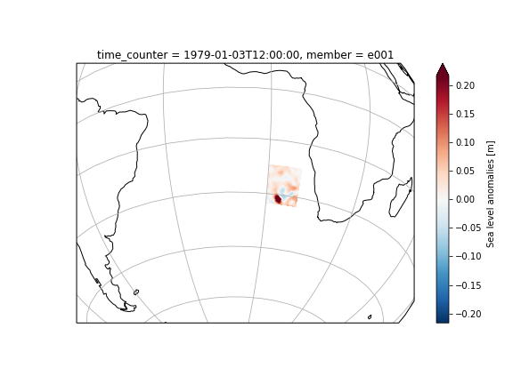

# A Machine Learning Technique to Attenuate the Imprint of Chaotic Ocean Variability in Altimetric Observations

Mickaël Lalande\affil{1}, Redouane Lguensat\affil{1}, Sally Close\affil{1} and Thierry Penduff\affil{1}}

\affiliation{1}{Universit\'e Grenoble Alpes, CNRS, IRD, Grenoble-INP, IGE, Grenoble, France; CS 40700, 38058 Grenoble Cedex 9, France}
Mickaël LALANDE 
Supervisors: Thierry PENDUFF and Redouane LGUENSAT 
Master 2 in Earth, planetary and environmental sciences 
Atmosphere-Climate-Continental Landmass Programme 
04/02/2019 - 28/06/2019 (5 months)

[IGE - Institut des Géosciences de l'Environnement](http://www.ige-grenoble.fr/) 
[UFR Phitem - Université Grenoble Alpes](https://phitem.univ-grenoble-alpes.fr/)

 

This repository aims to make available the codezerr the preliminary study of the model choice section of the report. More details can be seen in the **notebooks** folder :
-  **visualize_data.ipynb** shows basics plots to visualize the data 
-  **plot_results.ipynb** shows some results of the filtering by the machine learning.

# Study zone 
We made our choice on a reduced zone (Agulhas eddies), in order to be able to test many different models. The choice of this zone was made to cover some chaotic zone (south of the map around eddies) and more forced area (north of the zone). We then applied these results to a bigger zone in the report.

# Example of result
The goal is to reconstruct the forced part of the total signal of sea level anomalies from 1979 to 1999 from an ensemble simulation with 50 members. The forced part is defined as the ensemble mean.

#### This is only an additional material for the report. All details and further study can be found in there.
<!--stackedit_data:
eyJoaXN0b3J5IjpbLTIwNDQxNjAyMjVdfQ==
-->